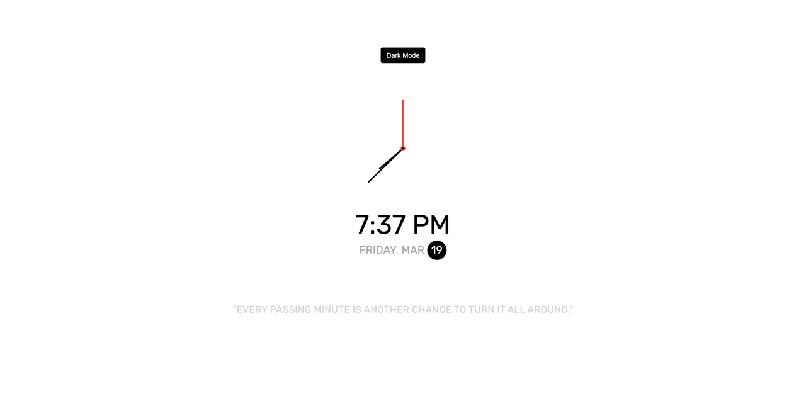
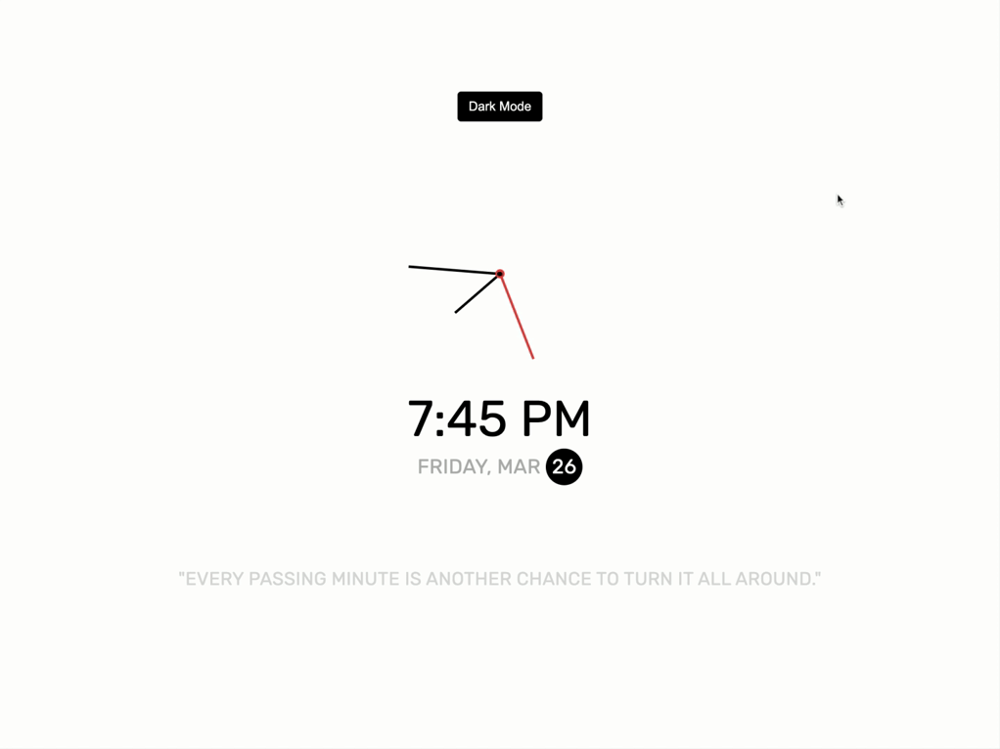

<p id="header"><p>

<table><tr>
<td> <a href="https://github.com/emjose/analog-clock-1/#header"></a> </td>
<td> <a href="https://github.com/emjose/one-hundred/#header"></a> </td>
<td> <a href="https://github.com/emjose/vertical-cards/#header"></a> </td>
</tr></table>

<br>

<p id="project-title"><p>

<a href=#table-of-contents></a>

<br>

<a href="https://emjose.github.io/analog-clock-2/"></a>

#

<p id="table-of-contents"><p>

<a href=#table-of-contents></a>

-   [100 Days of Code](#100days)
-   [Installation](#installation)
-   [Live Site](#live-site)
-   [Resources](#resources)
-   [Copyright](#copyright)
-   [Let's Connect!](#lets-connect)

<br>

#

<p id="100days"><p>

<a href=#100days></a>

### Day 8: February 11, 2021

-   I love analog clocks, and I looked up tutorials on how to make clocks with JavaScript, HTML, and CSS.

-   This clock has a light and dark mode. See <a href="https://github.com/emjose/analog-clock-1/#header">first clock project</a>.

-   The quote <a href="https://youtu.be/nij1M8Brd00?t=430">"Every passing minute is another chance to turn it all around"</a> is from the film <a href="https://youtu.be/nij1M8Brd00?t=430">Vanilla Sky</a>.

<br>

#

<p id="installation"><p>

<a href=#installation></a>

#### 1. Git clone and cd into the repo folder:

```console
git clone git@github.com:emjose/analog-clock-2.git && cd analog-clock-2
```

#### 2. Run the command:

```console
open index.html
```

<br>

#

<p id="live-site"><p>

<a href="https://emjose.github.io/analog-clock-2/"></a>

<a href="https://emjose.github.io/analog-clock-2/"></a>

• **[Analog Clock 2](https://emjose.github.io/analog-clock-2/)** is responsive and keyboard-navigable.

• **[Analog Clock 2](https://emjose.github.io/analog-clock-2/)** is a [progressive web app](https://developer.mozilla.org/en-US/docs/Web/Progressive_web_apps).

• Users can toggle between light and dark mode, and mode preference will persist in local storage.

<br>

#

<p id="resources"><p>

<a href=#resources></a>

-   #### [50 Projects in 50 Days](https://50projects50days.com/)

-   #### [Neumorphism Generator](https://neumorphism.io/) by [Adam Giebl](https://github.com/adamgiebl)

-   #### [Neumorphism Analog Clock Tutorial](https://youtu.be/NVoIEEb0Hqg) by [CodingNepal](https://www.youtube.com/channel/UCk7xIEmd3MeyhIu2StLX5yA)

-   #### [Neumorphism the Right Way — A 2020 Design Trend](<https://medium.com/@artofofiare/neumorphism-the-right-way-a-2020-design-trend-386e6a09040a#:~:text=Neumorphism%20(or%20Neo%2Dskeuomorphism),let's%20look%20at%20%E2%80%9CSkeuomorphism%E2%80%9D.>)

-   #### [Theme Clock Tutorial from the 50 Projects in 50 Days Udemy Course](https://www.udemy.com/course/50-projects-50-days/)

-   #### Vanilla Sky clip: ["Every passing minute is another chance to turn it all around."](https://youtu.be/nij1M8Brd00?t=430)

-   #### [The simplest CSS variable dark mode theme](https://lukelowrey.com/css-variable-theme-switcher/)

-   #### [My blog on how I created my Github READMEs](https://emmanueljose.medium.com/readme-a-makeover-story-b9c7be37a6de?sk=7ae6623d365409d875753e4604e42ffd)

<br>

#

<p id="copyright"><p>

<a href=#copyright></a>

-   This project is for made for educational purposes only.

-   <a href="https://www.paramount.com/movies/vanilla-sky">Vanilla Sky</a> is copyright of <a href="https://innersloth.com/">Paramount Pictures</a>. © Paramount Pictures. All Rights Reserved.

<br>

#

<p id="lets-connect"><p>

<a href=#lets-connect></a>

<p><a href="https://twitter.com/Emmanuel_Labor"></a> <a href="https://www.linkedin.com/in/emmanuelpjose/"></a> <a href="https://emmanueljose.medium.com/"></a> <a href="https://www.instagram.com/emmanuel_jose/"></a> <a href="mailto:emjose@gmail.com"></a> <a href="https://www.emmanuel-jose.com/"></a> <a href="https://github.com/emjose"></a></p>

#

<a href=#header></a>
